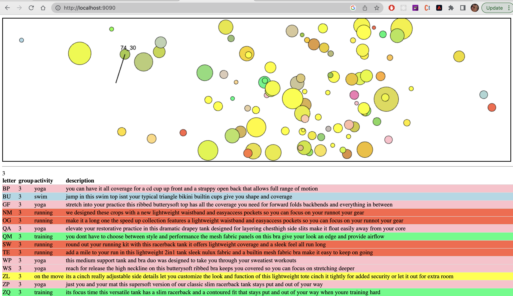

# seo_product_explorer
Cluster 1000s of products to allow SEO people to better target their adverts. 

# use it ( to see the clusters )       
1: cd show_clusters 
2: cli: python main.py 
3: browser: localhost:9090
4: Mouse around in the viewport; You will see a metro style picker to indicate which bubble is under-examination; click for details 

# What will this do?
It will read information from the '*output.txt' files copied over from the 'create_clusters' directory, and use html5 canvas to show the various clusters 

# What are the colors for?   
In the source datastore all products belong to 1 of 12 ( or so ) different 'product categories' such as 'tennis' or 'outdoors' etc etc. 
Each of those categories was assigned an arbituary color. The bubbles in the KNN graph reflect that averaged color on the products represented by that bubble's collected affinity products 

# What is the size of the bubbles for?  
The size of the bubble reflects how many collected affinity products were discovered     

# screen shot

# BONUS INFORMATION: 

# knn.py setup and notes
- Optional: use a virtual env
pip install virtualenv
source /Users/pmontgomery/SEO/product_space/env/bin/activate

- The first time you run knn.py it will take a while. It will always take a while to run, but the first time it especially will.

- pip install -r requirements.txt
This is the equivilent of 'npm install' 

- My system uses python 3.10

- If you haven't already:   
python -m spacy download en_core_web_md  
That will be the pre-trained spacy english model  

# kmeans.ipynb setup and notes 
knn.py and kmeans.ipynb do the same thing  
I actually prefer the notebook version,  
but I made the knn.py because sometimes notebook   
isn't set up on a machine.  
Also - something like knn.py would be easier to use from a flask server  

# product_space
TODO: Desc 'word embedding' here. And how that is related to our product space. 
